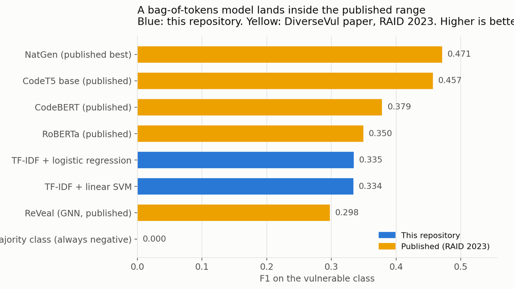

<!-- Venu Mandadi profile overview -->

  

<h1 align="center">Mandadi Venu Madhav Reddy</h1>

  <b>Java backend engineering</b> &nbsp;·&nbsp; multi-agent orchestration &nbsp;·&nbsp; applied machine learning

  B.Tech Computer Science and Engineering (AI and ML), KLH University, 2026 &nbsp;·&nbsp; Hyderabad, India

  
  
  

---

I build backend systems and then measure whether they actually work.

Most of my time goes into **Java and Spring Boot**, where my main project is a retail order backend built as a **multi-agent pipeline**: six independent agents coordinated by a single orchestrator, each handing its result to the next through one shared contract. I built it to understand how a real retail company moves an order from cart to delivery, not to put another storefront on the internet.

The rest of my work is applied machine learning, where I care most about **not fooling myself**: leakage-safe splits, held-out data touched once, and results reported next to published baselines rather than on their own.

---

## Featured work

### 1. Sampoorna Retail Backend

**A multi-agent order processing system in Java.** One `OrderOrchestrator` runs every order through six agents. The agents never call each other; the orchestrator calls them in sequence and decides what happens next based on what each one returns.

| Agent | What it does |
|---|---|
| **Catalogue** | Checks requested quantity against available stock and reserves the units |
| **Risk** | Applies address, order value and payment rules |
| **Payment** | Authorises UPI, card or cash on delivery and issues a payment reference |
| **Fulfilment** | Plans picking and packing, sets the delivery estimate |
| **Delivery** | Builds an eight-milestone timeline from order received to delivered |
| **Notification** | Records the final outcome into order history |

**How the agents communicate.** Every agent returns the same Java record carrying its name, a status of `completed`, `failed` or `skipped`, a message, and how long it took, alongside its own typed result such as the payment reference or the delivery timeline. The orchestrator merges all of it into one `OrderResponse` containing a step-by-step trace, so you can see exactly which agent did what and where an order stopped.

**Stock is a state machine, not a number.** Each line records stock before, quantity held and stock after, and every order resolves to one disposition:

- `COMMITTED` &nbsp;a confirmed order permanently deducts the stock
- `RELEASED` &nbsp;a declined payment returns held stock to available and cancels packing
- `REJECTED` &nbsp;an out-of-stock item is refused with nothing held, and the order stops **before** payment is taken

**A chat agent on top.** It reads a customer question, decides which of seven actions it needs (search, compare, view cart, checkout, find an order, list orders, help) and runs that action against the real catalogue, cart and order data, so it cannot invent a price or a stock figure.

  
  
  
  
  
  
  

**184 products · 206 routes · 30 automated tests · 3 services in Docker Compose · CI on every push**

[Repository](https://github.com/venu0376/sampoorna-retail-platform) &nbsp;·&nbsp; [Live application](https://sampoorna-retail.vercel.app)

---

### 2. AI Source-Code Vulnerability Detection

**Can a model read one C or C++ function and tell whether it contains a security bug?** Trained and evaluated on DiverseVul: 330,492 functions taken from real vulnerability-fixing commits across 741 open-source projects.

| Model | Precision | Recall | F1 |
|---|---:|---:|---:|
| Majority class baseline | 0.000 | 0.000 | 0.000 |
| TF-IDF + logistic regression | 0.262 | 0.462 | **0.335** |
| TF-IDF + linear SVM | 0.304 | 0.370 | 0.334 |

Published results on the same dataset run from 0.298 (ReVeal GNN) to 0.472 (NatGen), so a plain lexical model lands inside the range of pre-trained neural code models. Scored on a like-for-like sample it also **beat three hosted language models prompted zero-shot**, including one with 120 billion parameters.

**Two dataset defects found and fixed before training**, both of which quietly inflate results if you miss them:

- **1,425 training functions** also appeared in the validation or test splits and were removed
- **33,810 CWE labels** sit on non-vulnerable rows, because the label comes from the fixing commit and lands on both versions of a function

Accuracy is reported exactly once in that repository, as a baseline, to show that predicting "not vulnerable" for everything scores 94.16% and finds nothing.

  
  
  
  

**92 tests · 92% line coverage · CI coverage gate · threshold frozen on validation before the test split was scored once**

[Repository](https://github.com/venu0376/ai-code-vulnerability-detection)

---

### 3. Multi-City Weather Forecasting

**Next-day temperature and rainfall for 20 cities**, built from 1,753,440 hourly observations spanning 2016 to 2025.

Trained on 2016 to 2023, tuned on 2024, and scored once on 2025 which the model had never seen. Splitting by time rather than at random is the whole point: shuffling weather data lets a model peek at the future and produces a number that looks good and means nothing.

**0.966°C** next-day temperature error &nbsp;·&nbsp; **0.822** rain F1 &nbsp;·&nbsp; error reported city by city rather than as a single average

  
  
  

[Repository](https://github.com/venu0376/metro-weather-forecasting)

---

### 4. Retail Sales KPI Analytics

**1.07 million public transactions** cleaned into Parquet and modelled as a star schema in DuckDB, with the whole transformation kept in version-controlled SQL rather than manual spreadsheet steps.

Six report pages built on reusable DAX measures, covering revenue, monthly trend, product performance, market and customer mix, returns, and a data-quality page that surfaces rejected rows instead of dropping them silently.

  
  
  
  

[Repository](https://github.com/venu0376/retail-sales-kpi-analytics)

---

## Also built

### Campus Course Enrollment Platform

A MERN enrollment system where the interesting problem is concurrency: when one seat remains and two students submit at the same instant, exactly one must win. Protected admin routes, forced student registration and atomic seat reservation.

  
  
  
  

[Repository](https://github.com/venu0376/campus-course-enrollment-platform)

### Campus Helpdesk API

A Flask and SQLite academic support API with FAQ search, routed tickets, and every documented error contract covered by a test.

  
  
  

[Repository](https://github.com/venu0376/campus-helpdesk-api)

---

## Skills

**Languages**  
Java · Python · TypeScript · JavaScript · SQL · C

**Backend and APIs**  
Spring Boot · Spring MVC · Jakarta Bean Validation · Java records · dependency injection · Maven · multi-agent orchestration · REST API design · FastAPI · Flask · Node.js · Express.js · JWT

**Data and machine learning**  
scikit-learn · pandas · NumPy · feature engineering · leakage control · model evaluation · time-series validation · DuckDB · Parquet · Power BI · DAX

**Frontend**  
Next.js · React · TypeScript

**DevOps and testing**  
Docker · multi-stage builds · Docker Compose · GitHub Actions CI · Git · Vercel · JUnit · pytest · Vitest · Postman

  
  
  
  
  
  
  
  
  
  

---

## Education

**B.Tech, Computer Science and Engineering (AI and ML)** · KLH University · Jul 2022 to Jun 2026 · GPA 8.78 / 10  
**Intermediate (Class 12)** · Sri Chaitanya Junior College · Jun 2020 to May 2022 · 92.4%  
**SSC (Class 10)** · Alpha High School · May 2020 · GPA 10.0 / 10

## Experience

**Web Development Intern** · Prodigy Infotech · Remote · Mar 2024 to Apr 2024  
Built responsive React interfaces from written requirements and delivered two working web applications.

## Certifications

AWS Certified Cloud Practitioner &nbsp;·&nbsp; MongoDB Python Developer Path &nbsp;·&nbsp; Automation Anywhere RPA

---

  <a href="mailto:venumandadi31@gmail.com">venumandadi31@gmail.com</a> &nbsp;·&nbsp;
  <a href="https://www.linkedin.com/in/venu-reddy-mandadi-82b78128a">LinkedIn</a> &nbsp;·&nbsp;
  Hyderabad, India

