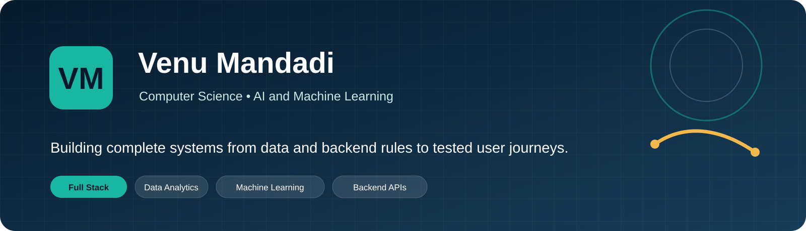
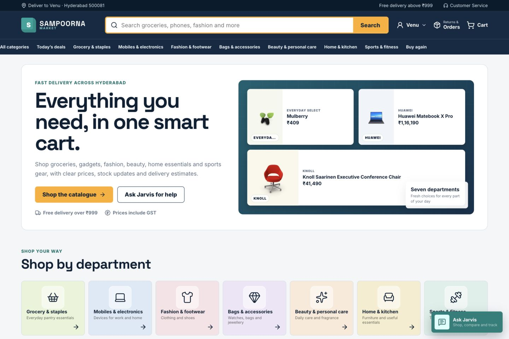
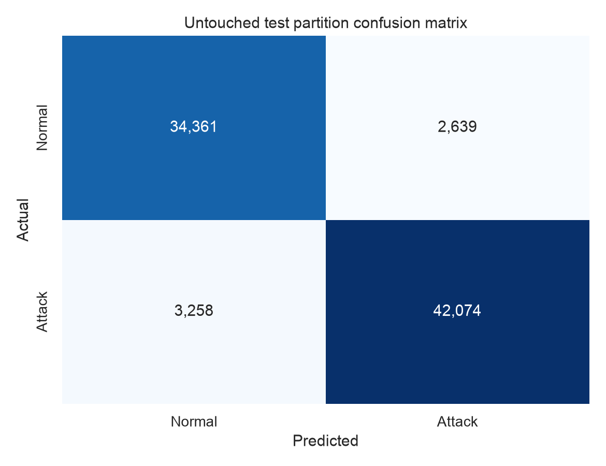
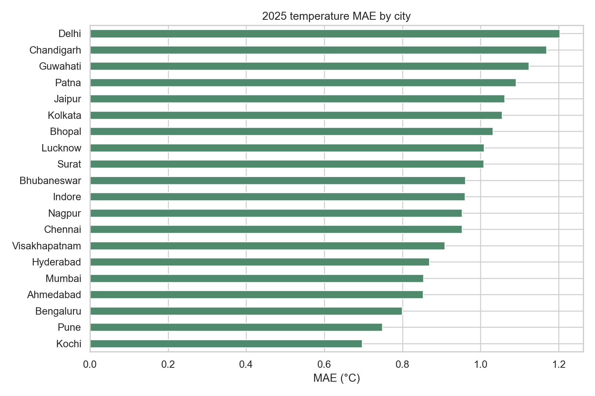
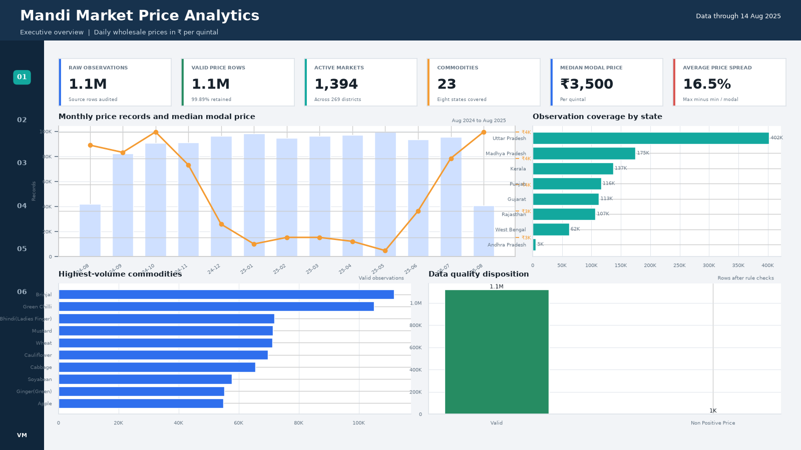
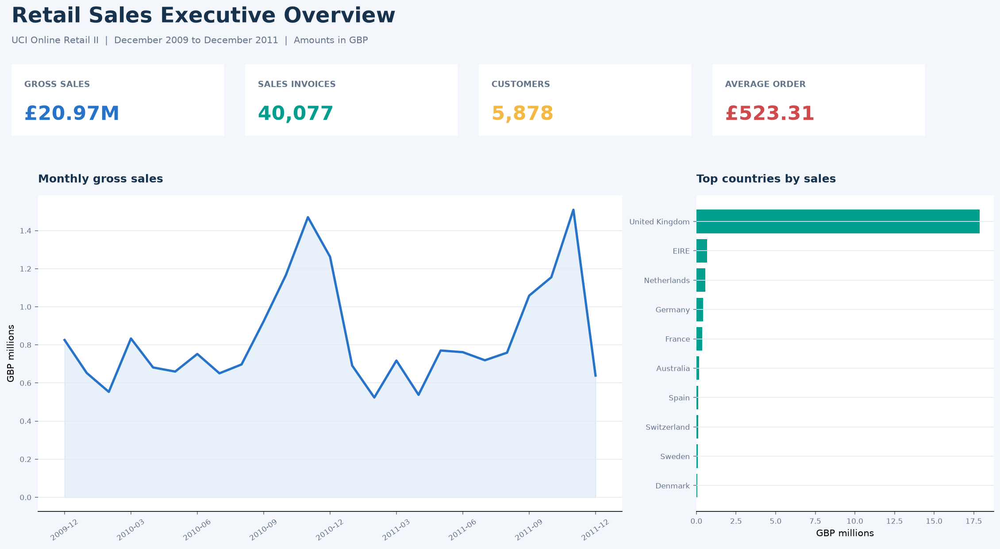
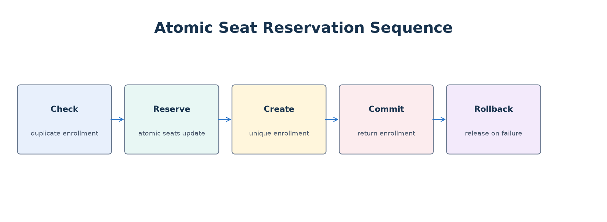
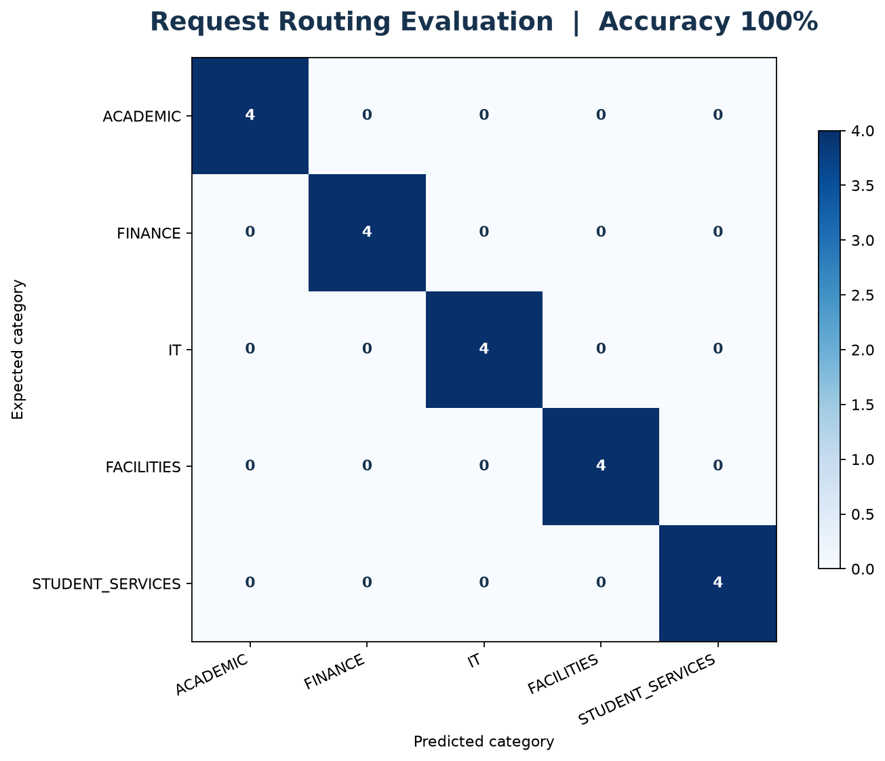

  

  <a href="mailto:venumandadi31@gmail.com">Email</a>&nbsp;&nbsp;•&nbsp;&nbsp;
  <a href="https://www.linkedin.com/in/venu-reddy-mandadi-82b78128a">LinkedIn</a>&nbsp;&nbsp;•&nbsp;&nbsp;
  <a href="https://github.com/venu0376">GitHub</a>&nbsp;&nbsp;•&nbsp;&nbsp;
  Hyderabad, India

I am a Computer Science graduate specialising in Artificial Intelligence and Machine Learning at KLH University. I enjoy building projects where the interface, backend rules, data processing and tests form one complete flow. My recent work covers ecommerce orchestration, network security, forecasting and business analytics.

## Selected work

<table>
  <tr>
    <td width="50%" valign="top">
      
      <h3><a href="https://github.com/venu0376/sampoorna-retail-platform">Sampoorna Retail Platform</a></h3>
      
A 184-product ecommerce application with search, comparison, Jarvis support, cart, checkout, payment failures, inventory changes, delivery milestones, returns and order history.

      
<code>Next.js</code> <code>TypeScript</code> <code>Java</code> <code>Spring Boot</code> <code>Python</code> <code>FastAPI</code>

    </td>
    <td width="50%" valign="top">
      
      <h3><a href="https://github.com/venu0376/sentinel-network-threat-detection">Sentinel Network Threat Detection</a></h3>
      
A leakage-safe UNSW-NB15 classification workflow with threshold selection, untouched test evaluation and attack-category error analysis. Test F1 is 0.935 across 82,332 flows.

      
<code>Python</code> <code>scikit-learn</code> <code>pandas</code> <code>Cybersecurity</code>

    </td>
  </tr>
  <tr>
    <td width="50%" valign="top">
      
      <h3><a href="https://github.com/venu0376/metro-weather-forecasting">Metro Weather Forecasting</a></h3>
      
Next-day temperature and rain forecasting for 20 cities using 1,753,440 hourly observations and chronological validation. Test temperature MAE is 0.966°C.

      
<code>Python</code> <code>Time Series</code> <code>Open-Meteo</code> <code>Model Evaluation</code>

    </td>
    <td width="50%" valign="top">
      
      <h3><a href="https://github.com/venu0376/mandi-market-price-analytics">Mandi Market Price Analytics</a></h3>
      
A governed analysis of 1,117,630 valid market-price rows across 23 commodities, with a DuckDB star schema, reusable DAX and six Power BI-style report pages.

      
<code>Python</code> <code>SQL</code> <code>DuckDB</code> <code>Power BI</code>

    </td>
  </tr>
</table>

## More complete builds

<table>
  <tr>
    <td width="33%" valign="top">
      
      <h3><a href="https://github.com/venu0376/retail-sales-kpi-analytics">Retail Sales KPI Analytics</a></h3>
      
1.07 million public transactions cleaned into Parquet with SQL, DAX and six report pages.

    </td>
    <td width="33%" valign="top">
      
      <h3><a href="https://github.com/venu0376/campus-course-enrollment-platform">Campus Course Enrollment</a></h3>
      
MERN enrollment with forced student registration, protected admin routes and atomic seat reservation.

    </td>
    <td width="33%" valign="top">
      
      <h3><a href="https://github.com/venu0376/campus-helpdesk-api">Campus Helpdesk API</a></h3>
      
Flask and SQLite academic support API with FAQ search, routed tickets and tested error contracts.

    </td>
  </tr>
</table>

## Skills

  
  
  
  
  
  
  
  
  
  

Python, Java, JavaScript, TypeScript, SQL, React, Next.js, Spring Boot, Flask, FastAPI, MongoDB, DuckDB, pandas, scikit-learn, Power BI, Git, Docker and Vercel.

## Education and experience

**B.Tech in Computer Science and Engineering, Artificial Intelligence and Machine Learning**  
KLH University, 2026

**Web Development Intern**  
Prodigy Infotech, March 2024 to April 2024

## Certifications

AWS Certified Cloud Practitioner  •  MongoDB Python Developer Path  •  Automation Anywhere RPA Certification

